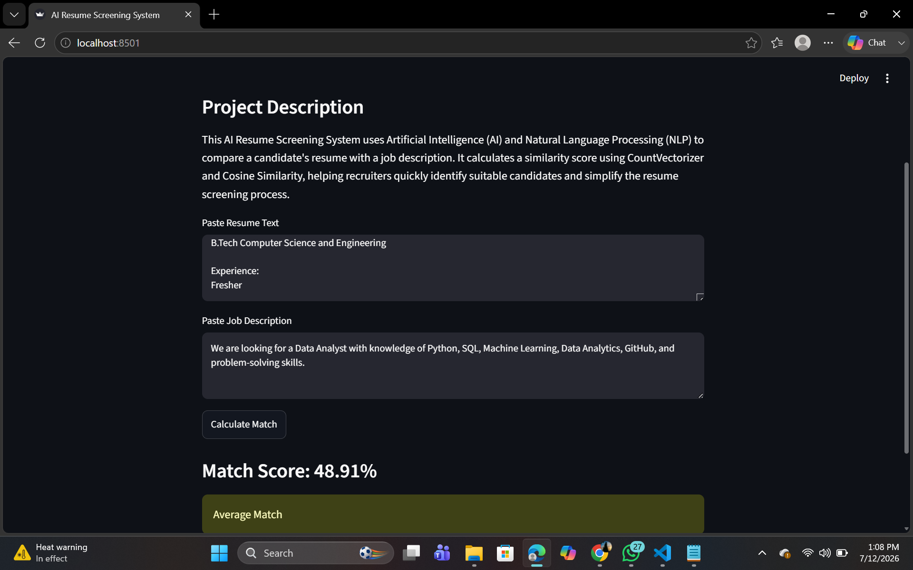

<div align="center">


# 🤖 AI Resume Screening System

### Intelligent Resume Matching using Machine Learning & Natural Language Processing

<p>


</p>


### 📄 Helping recruiters evaluate resumes faster with AI-powered candidate matching.

</div>

---

# 🌍 Overview

**AI Resume Screening System** is a machine learning application that compares resumes with job descriptions using **Natural Language Processing (NLP)** techniques.

The system analyzes textual similarity between a candidate's resume and a target job description, producing a match score to support recruitment decisions.

---

# ✨ Features

| Feature | Description |
|----------|-------------|
| 📄 Resume Analysis | Process and analyse resume content |
| 💼 Job Description Matching | Compare resumes against job requirements |
| 📊 Match Percentage | Calculate similarity score |
| 🤖 NLP Processing | Extract meaningful textual features |
| 📈 Machine Learning | Score candidate-job compatibility |
| 🌐 Interactive Dashboard | User-friendly Streamlit interface |

---

# 🏗 System Workflow

```text
Resume
      │
      ▼
Text Preprocessing
      │
      ▼
Natural Language Processing
      │
      ▼
Feature Extraction
      │
      ▼
Similarity Calculation
      │
      ▼
Match Score
      │
      ▼
Interactive Dashboard
```

---

# 📸 Preview

<div align="center">

### Resume Screening Dashboard

 

</div>

---

# 💻 Technology Stack

| Technology | Purpose |
|------------|----------|
| 🐍 Python | Core Development |
| 📊 Streamlit | Web Application |
| 🤖 Scikit-learn | Machine Learning |
| 📝 NLP | Text Processing |
| 🐼 Pandas | Data Handling |

---

# 📂 Project Structure

```text
📦 ai-resume-screening-system

├── 📄 app.py
├── 📄 requirements.txt
├── 📄 README.md
│
├── 📂 models
│
├── 📂 data
│
├── 📂 resumes
│
├── 📂 screenshots
│
└── 📂 utils
```

---

# 🚀 Installation

Clone the repository

```bash
git clone https://github.com/rajeswari1211/AI-Resume-Screening-System.git
```

Navigate into the project

```bash
cd ai-resume-screening-system
```

Install dependencies

```bash
pip install -r requirements.txt
```

Run the application

```bash
streamlit run app.py
```

---

# 📊 Core Capabilities

✔ Resume Parsing

✔ Text Cleaning

✔ Job Description Analysis

✔ Candidate Matching

✔ Similarity Scoring

✔ Interactive Dashboard

---

# 🎯 Skills Demonstrated

- Machine Learning
- Natural Language Processing
- Python
- Scikit-learn
- Streamlit
- Text Analytics
- Data Processing
- AI Application Development

---

# 🌟 Why This Project?

Recruiters often spend significant time manually reviewing resumes.

This project demonstrates how machine learning and NLP can automate part of that process by measuring how closely a resume aligns with a job description, providing a consistent similarity score to support human decision-making.

---

# 🔮 Future Roadmap

- 📄 PDF & DOCX Resume Parsing
- 🤖 Transformer-based NLP Models (BERT)
- 📊 ATS Compatibility Score
- 🧠 Skill Gap Analysis
- 🌍 Multi-language Resume Support
- 📧 Recruiter Dashboard
- ☁ Cloud Deployment
- 👥 Candidate Ranking System

---

# 👨‍💻 Author

## **Rajeswari Kamepalli**

### B.Tech CSE Student | Data Analyst | AI Developer

<p align="center">

<a href="https://github.com/rajeswari1211">


</a>

</p>

---

<div align="center">

⭐ **If you found this project useful, consider giving it a Star!**


</div>
